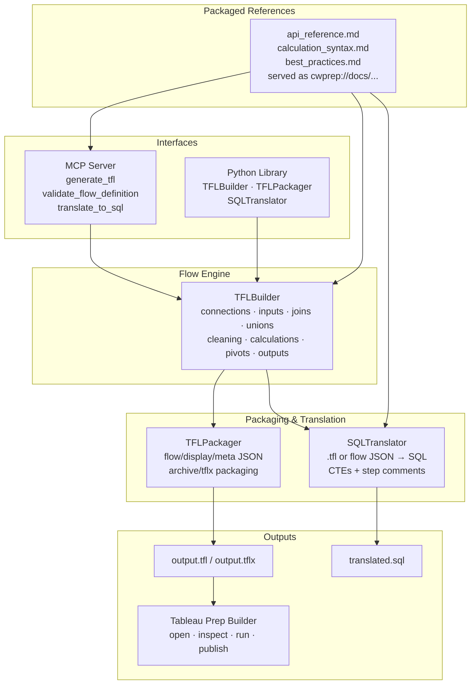

# cwprep

<p align="center">
  
</p>

> 面向可复现 `.tfl` / `.tflx` 生成、验证与 SQL 转译的 Tableau Prep Flow 工程层。

<p align="center">
  
</p>

**cwprep** 是一个 Python 工具包和 Model Context Protocol（MCP）服务器，用来通过代码或 Agent 工具调用构建 Tableau Prep flows。

它的定位是 **PrepFlow engineering layer**，不是通用对话式分析 Agent。重点是可复现、可检查，以及在本地工作流、脚本和 AI 客户端中安全自动化。

`cwprep` 中的 `cw` 来自 `Cooper Wenhua`。

**作者：** Cooper Wenhua &lt;imgwho@gmail.com&gt;

[Website](https://datacooper.com) · [Source](https://github.com/aidatacooper/cwprep) · [Changelog](https://github.com/aidatacooper/cwprep/blob/main/changelog.md)

[](https://pepy.tech/projects/cwprep)
[](https://datacooper.com)
[](https://github.com/aidatacooper/cwprep)
[](https://github.com/aidatacooper/cwprep/blob/main/LICENSE)
[](https://www.python.org/)

[](https://star-history.com/#aidatacooper/cwprep&Date)

[试用示例工作流](examples/demo_mcp_flow.py) · [阅读中文指南](docs/guide.zh-CN.md) · [Read the guide](https://github.com/aidatacooper/cwprep/blob/main/docs/guide.md)

## 快速开始

### 安装

```bash
pip install cwprep
```

### 作为 MCP Server 运行

```bash
uvx cwprep
```

上面的短命令是最简单的 MCP 客户端配置，也是本仓库展示的默认配置。当人工在交互式终端中直接运行 `cwprep` 时，它会打印 CLI 帮助，而不是启动 stdio MCP。

把 server 添加到你的 MCP 客户端：

```json
{
  "mcpServers": {
    "cwprep": {
      "command": "uvx",
      "args": ["cwprep"]
    }
  }
}
```

Claude Code：

```bash
claude mcp add cwprep -- uvx cwprep
```

VSCode 中可以在 workspace 或 user `mcp.json` 中添加 `cwprep`，命令使用 `uvx cwprep`。

如果你偏好显式脚本名，这些启动方式也等价：

```bash
cwprep mcp
uvx --from cwprep cwprep-mcp
cwprep-mcp
python -m cwprep.mcp_server
```

完整客户端配置和参考见 [中文指南](docs/guide.zh-CN.md) 或 [英文指南](https://github.com/aidatacooper/cwprep/blob/main/docs/guide.md)。

### 使用 CLI

```bash
cwprep --help
cwprep doctor
cwprep status
cwprep capabilities
cwprep validate examples/basic_flow.yaml
cwprep run examples/basic_flow.yaml --out demo_output/cli_basic_flow.tfl
cwprep translate examples/basic_flow.yaml --out demo_output/cli_basic_flow.sql
```

`cwprep run` 使用与 MCP tools 相同的声明式 flow 结构，因此 spec 可以在本地终端、CI jobs 和 Agent 之间直接复用。

## 亮点

| 领域 | 能力 |
|---|---|
| Flow authoring | 从 Python 或声明式 MCP definitions 生成 Tableau Prep `.tfl` / `.tflx` |
| Data inputs | 连接 MySQL、PostgreSQL、SQL Server、Alibaba AnalyticDB for MySQL、CSV、Excel、custom SQL 和 table inputs |
| Prep operations | 构建 joins、unions、filters、value filters、keep/remove columns、renames、calculations、quick clean、type changes、aggregates、pivots、unpivots |
| Packaging | 保存最终 `.tfl` archive 或带嵌入数据文件的 `.tflx` |
| SQL translation | 把生成或已有 `.tfl` flow 转译为可读 ANSI SQL CTEs |
| CLI workflow | 在终端或 CI 中验证 specs、生成 flows、查看 capabilities、转译 SQL |
| MCP support | 从 Claude、Cursor、VSCode、Gemini CLI、Continue 或其他 MCP 客户端驱动 flow 生成 |

## 效果演示

这个 GIF 展示了 MCP 工具如何设计并生成 Tableau Prep flow。

<p align="center">
  
</p>

## 架构

```text
                            Interfaces
  +---------------------------------------------------------------+
  |  +--------------------------+  +---------------------------+  |
  |  |        MCP Server        |  |      Python Library       |  |
  |  |  generate_tfl            |  |  from cwprep import       |  |
  |  |  validate_flow_definition|  |  TFLBuilder, TFLPackager |  |
  |  |  translate_to_sql        |  |                           |  |
  |  |                          |  |  builder.add_...()       |  |
  |  |                          |  |  builder.build()         |  |
  |  |  (Claude / Cursor /      |  |  TFLPackager.save_tfl()  |  |
  |  |   VSCode / Gemini)       |  |                           |  |
  |  +------------+-------------+  +-------------+-------------+  |
  |               +-----------------------------+                 |
  +---------------------------------------------|-----------------+
                                                v
  +---------------------------------------------------------------+
  |                    Packaged References                        |
  |    api_reference.md  calculation_syntax.md  best_practices.md |
  |    served as cwprep://docs/... MCP resources                  |
  +----------------------------+----------------------------------+
                               v
  +---------------------------------------------------------------+
  |                         TFLBuilder                            |
  |       connections  inputs  joins  unions  cleaning            |
  |       calculations  aggregates  pivots  outputs               |
  +-------------+-------------------+-----------------------------+
                |                   |
                v                   v
  +--------------------------+  +-------------------------------+
  |       TFLPackager        |  |        SQLTranslator          |
  |  flow/display/meta JSON  |  |  .tfl or flow JSON -> SQL    |
  |  archive/tflx packaging  |  |  CTEs + step comments        |
  +------------+-------------+  +---------------+---------------+
               |                                |
               v                                v
       output.tfl / output.tflx          translated.sql
               |
               v
  +---------------------------------------------------------------+
  |                      Tableau Prep Builder                     |
  |          Open, inspect, run, publish, or continue editing      |
  +---------------------------------------------------------------+
```

Mermaid 视图：



Reference 层随库一起打包，因此 Agent 和脚本可以从已知可用的 API 指导开始，解析 Tableau Prep 计算语法，并避免常见 flow 设计坑，而不依赖源码仓库。

## Agent 架构

cwprep 面向工具调用型 Agent，而不只是直接 Python 调用。MCP server 提供紧凑的 flow generation surface；resource documents 在生成前提供阶段化 Tableau Prep 指导。

```text
Human or agent prompt
        |
        v
MCP server instructions
        |
        v
Resource documents
api-reference -> calculation-syntax -> best-practices
        |
        v
Flow tools
validate_flow_definition -> generate_tfl / translate_to_sql
        |
        v
.tfl / .tflx artifact + optional SQL representation
```

Prompt 说明要构建什么；Resources 说明如何正确构建；工具调用让生成的 flow 可检查、可复现。

## 能力边界

cwprep 刻意保持较小的公开能力面：

| Level | Meaning |
|---|---|
| Core | 稳定基础能力，适合 SDK 文档、示例和 MCP 工作流 |
| Advanced | 支持的组合能力，例如 packaged `.tflx`、file unions、multi-column joins 和 SQL translation |
| Inspectable | exploded flow folders 和 internal JSON 可用于调试，但默认输出最终 archive |

当 Agent 需要判断某个 Prep operation 是否属于稳定能力面时，使用 `list_supported_operations`。

## 设计决策

- MCP 工作流是 definition-first：先设计 flow，再验证 JSON contract，最后生成 archive。
- Resource documents 是阶段化操作指南，不是泛泛的 prompt stuffing。
- SDK 和 MCP 默认只输出最终 `.tfl` / `.tflx` archive。只有明确需要 exploded folder 检查时才使用 `save_to_folder()`。
- Tableau Prep calculation syntax 不是 SQL syntax。Agent 创建公式前应读取 `cwprep://docs/calculation-syntax`。
- SQL translation 用于可读性审查和迁移辅助，不是 Tableau Prep execution 的替代品。
- 文件替换是防御式的：先写临时 artifacts，再备份已有输出，最后替换。

## 验证

cwprep 提供四层 flow 验证和审查：

| Level | Description | Requires |
|---|---|---|
| **1. Definition validation** | 生成文件前验证声明式 MCP flow definition | 无 |
| **2. Archive generation safety** | 写临时 artifacts、备份已有输出，并生成最终 `.tfl` / `.tflx` archive | 无 |
| **3. SQL translation review** | 将支持的 flow logic 转译为 ANSI SQL CTEs，用于审查和迁移规划 | 无 |
| **4. Tableau Prep openability** | 在 Tableau Prep Builder 中打开生成的 archive 做最终产品验证 | Tableau Prep Builder |

```python
from cwprep import TFLBuilder, TFLPackager

builder = TFLBuilder(flow_name="Customer Orders")
# ... add connections, inputs, transforms, and outputs ...
flow, display, meta = builder.build()
TFLPackager.save_tfl("./customer_orders.tfl", flow, display, meta)
```

```bash
# MCP tools
validate_flow_definition(flow_definition={...})
generate_tfl(flow_definition={...}, output_path="customer_orders.tfl")
translate_to_sql(tfl_path="customer_orders.tfl")
```

## FAQ

### `.tfl` 和 `.tflx` 有什么区别？

`.tfl` 是 Tableau Prep flow archive。`.tflx` 是打包版本，可以包含 flow 使用的本地数据文件。

### cwprep 会打开或运行 Tableau Prep Builder 吗？

不会。cwprep 生成 Tableau Prep Builder 可以打开的文件，但不会自动化 Tableau Prep 桌面 GUI。

### `validate_flow_definition` 会保存文件吗？

不会。`validate_flow_definition` 在生成前检查 flow definition。真正写出 `.tfl` 或 `.tflx` archive 的 MCP 工具是 `generate_tfl`。

### cwprep 可以把 flow 转成 SQL 吗？

可以。`SQLTranslator` 和 `translate_to_sql` MCP tool 可以把支持的 `.tfl` flow logic 转译为 ANSI SQL 风格的 CTEs。

### 什么时候用 `uvx cwprep`，什么时候用 `python -m cwprep.mcp_server`？

正常 MCP 工作流使用 `uvx cwprep`。显式本地 MCP 测试时使用 `cwprep mcp` 或 `python -m cwprep.mcp_server`，避免依赖智能入口检测。

兼容性入口 `uvx --from cwprep cwprep-mcp` 和 `cwprep-mcp` 仍然可用。

### 完整指南在哪里？

见 [中文指南](docs/guide.zh-CN.md) 或 [英文在线指南](https://github.com/aidatacooper/cwprep/blob/main/docs/guide.md)。

## 文档

- [中文指南](docs/guide.zh-CN.md)
- [英文 Guide](https://github.com/aidatacooper/cwprep/blob/main/docs/guide.md)
- [Examples](https://github.com/aidatacooper/cwprep/blob/main/examples/README.md)
- [Changelog](https://github.com/aidatacooper/cwprep/blob/main/changelog.md)

## License

AGPL-3.0
